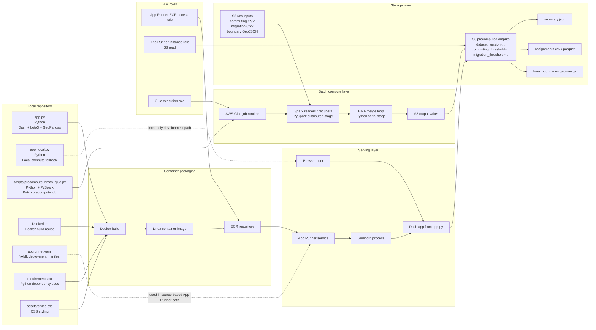
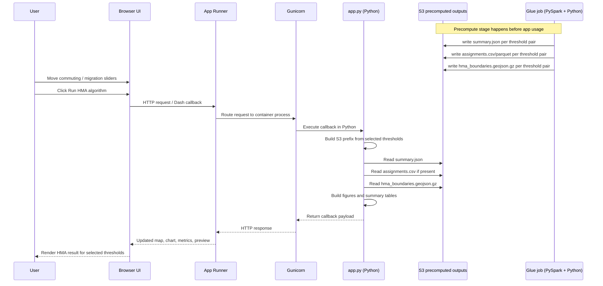

# Housing Market Areas Dashboard

Housing Market Areas Dashboard: an interactive Dash app for generating Housing Market Areas from commuting and migration flows.

## Features
- Existing GLA-styled layout, sidebar, dark mode and responsive behaviour preserved
- HMA generation using commuting self-containment and migration self-containment thresholds
- Interactive HMA map, summary metrics, largest-HMA chart and CSV download

## Data files
- A geometry source with `LAD23CD`, `LAD23NM` and valid boundary geometry
- Commuting flows CSV, default path `flow_data/commuting_flow_la_2023.csv`
- Migration flows CSV, default path `flow_data/migration_flow_la_2023.csv`

## Optional Environment Variables
- `HMA_GEOMETRY_FILE` — override the default geometry source
- `HMA_COMMUTING_FLOW_FILE` — override the default commuting flow CSV path
- `HMA_MIGRATION_FLOW_FILE` — override the default migration flow CSV path
- `HMA_PRECOMPUTED_S3_PREFIX` — S3 prefix containing precomputed threshold outputs for the deployed app
- `HMA_DATASET_VERSION` — dataset version folder to read from under the precomputed S3 prefix

## App Modes
- [app_local.py](/Users/user1/Documents/household_zone_dashboard_update/app_local.py) keeps the original local-compute version of the dashboard.
- [app.py](/Users/user1/Documents/household_zone_dashboard_update/app.py) loads precomputed HMA outputs from S3 at runtime.

## Local Development
1. Create and activate a Python environment (recommended):

```bash
python -m venv .venv
source .venv/bin/activate
```

2. Install dependencies:

```bash
pip install -r requirements.txt
```

3. Run locally with enviroment variable (development server).

Before the first local run in a new shell, authenticate with AWS SSO

```bash
python
export AWS_PROFILE= XXX AWS_REGION= XXX HMA_PRECOMPUTED_S3_PREFIX=s3://dpa-population-projection-data/dpa-apps/housing_zones_precomputed HMA_DATASET_VERSION=2026-04-15 PORT=8050 && /opt/anaconda3/envs/env/bin/python app.py
```

Open http://127.0.0.1:8050 in your browser.


## Production / App Runner
The repository contains an `apprunner.yaml` configured to run the app with Gunicorn on port `8080`.

Use an App Runner instance role with read access to:

```text
s3://dpa-population-projection-data/dpa-apps/housing_zones_precomputed/*
```

## Glue Precompute Job
Use [scripts/precompute_hmas_glue.py](scripts/precompute_hmas_glue.py) to precompute all threshold combinations in AWS Glue instead of running the HMA algorithm inside the Dash callback, less commute, faster and cheaper.

Example arguments:

```bash
spark-submit scripts/precompute_hmas_glue.py \
	--commuting-s3-uri s3://dpa-population-projection-data/dpa-apps/housing_zones_data/commuting_flow_la_2023.csv \
	--migration-s3-uri s3://dpa-population-projection-data/dpa-apps/housing_zones_data/migration_flow_la_2023.csv \
	--geometry-s3-uri s3://dpa-population-projection-data/dpa-apps/housing_zones_data/Local_Authority_Districts_December_2023_Boundaries_UK_BGC_2537431731774104276_simplified.geojson \
	--output-s3-prefix s3://dpa-population-projection-data/dpa-apps/housing_zones_precomputed \
	--dataset-version 2026-04-15
```

For a single validation run before computing all 289 threshold pairs, add:

```bash
	--single-commuting-threshold 0.725 \
	--single-migration-threshold 0.550
```

To generate the full threshold grid used by the sliders, remove both single-threshold arguments as stated above. With the default settings this computes:

- commuting thresholds from `0.500` to `0.900` in steps of `0.025`
- migration thresholds from `0.300` to `0.700` in steps of `0.025`
- `289` total threshold combinations

Data folder structure:

```text
housing_zones_precomputed/
  dataset_version=2026-04-15/
    commuting_threshold=0.500/
      migration_threshold=0.300/
      migration_threshold=0.325/
      migration_threshold=0.350/...
```

The deployed app expects each threshold folder to contain:

```text
summary.json
hma_boundaries.geojson.gz
assignments.csv
```

Where:
- `summary.json` contains the summary metrics and largest-HMA data for the app display
- `hma_boundaries.geojson.gz` contains the geometries of the resulting HMAs
- `assignments.csv` contains the LA-to-HMA assignments for data users to download and check
- `assignments.parquet` more efficient storage for the app use

## Architecture Diagrams
The diagrams below explain the deployment and runtime flow.

### Detailed HMA Deployment Architecture

The Python Dash app in `app.py` reads precomputed outputs from S3. The Glue script in `scripts/precompute_hmas_glue.py` uses PySpark for distributed reads and writes, then runs the core HMA merge logic in Python before saving the result set. The Dockerfile builds the runtime container, ECR stores it, and App Runner hosts it. The YAML file documents the source-based deployment path.



### Detailed Runtime Flow

This sequence shows what happens after deployment. The expensive work does not happen inside App Runner. The browser sends threshold values, the Python callback builds the S3 path, reads the precomputed files, and returns the map, metrics, and tables.



For a standalone export-friendly version, open `architecture_diagrams.html`, can print to PDF or take a screenshot.

## Troubleshooting
- If the app loads but the algorithm cannot run, the commuting and migration flow CSVs are missing or do not contain the expected columns.
- Geometry inputs must contain `LAD23CD` and valid boundary geometry.
- If you are using Python 3.12, install from the updated `requirements.txt` before running the app.

