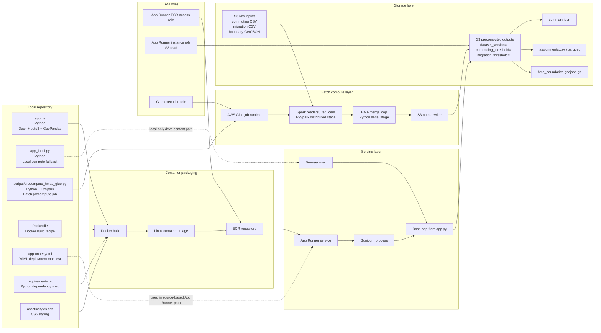
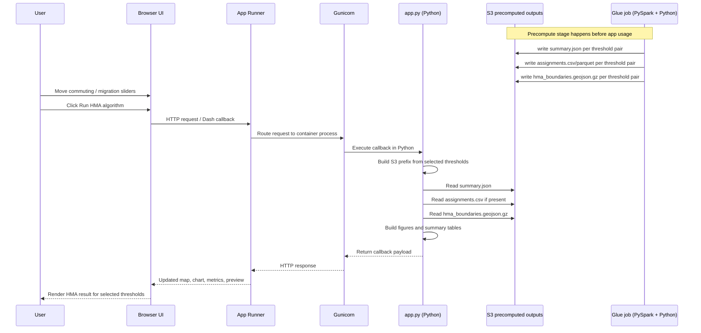

# Architecture Diagrams

This page explains the deployment and runtime flow for the Housing Market Areas dashboard.

## Detailed HMA Deployment Architecture

The Python Dash app in `app.py` reads precomputed outputs from S3. The Glue script in `scripts/precompute_hmas_glue.py` uses PySpark for distributed reads and writes, then runs the core HMA merge logic in Python before saving the result set. The Dockerfile builds the runtime container, ECR stores it, and App Runner hosts it. The YAML file documents the source-based deployment path.

## Detailed Runtime Flow

This sequence shows what happens after deployment. The expensive work does not happen inside App Runner. The browser sends threshold values, the Python callback builds the S3 path, reads the precomputed files, and returns the map, metrics, and tables.

## Export Option

For a standalone export-friendly page, open `architecture_diagrams.html` locally in a browser or VS Code preview and print to PDF or take a screenshot.